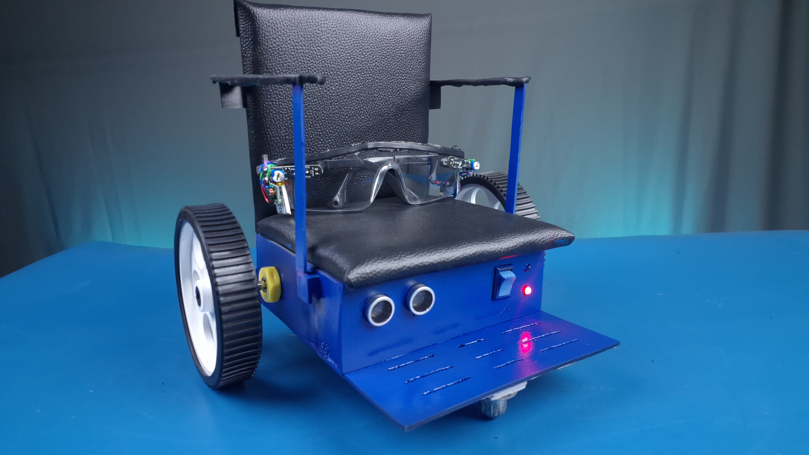
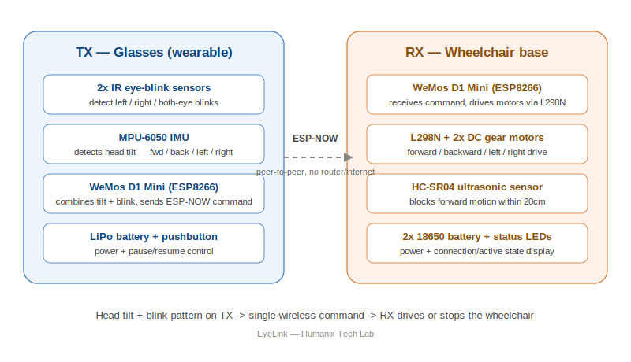
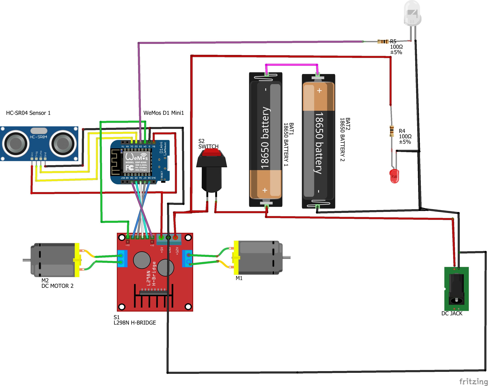

# EyeLink — Eye & Head Controlled Smart Wheelchair

**A ₹2,500 (~$30) hands-free wheelchair control system for people with severe motor disabilities — built from a pair of modified safety glasses and an ESP-NOW wireless link. No Wi-Fi, no app, no internet.**

<!--
IMAGE SLOT #1 — HERO BANNER
File: docs/images/01_hero_banner.jpg
What to shoot: Your single best photo — ideally the finished glasses sitting next to or on the finished wheelchair, good lighting, clean background. This is the FIRST thing anyone sees on the repo page.
Recommended size: 1280x720 or wider, landscape.
-->

> Commercial eye-tracking wheelchair controllers cost ₹4,00,000–₹16,00,000 ($5,000–$20,000). EyeLink does the same core job for ₹2,500 using a WeMos D1 Mini, an MPU-6050, two IR blink sensors, and ESP-NOW. Tilt your head to pick a direction, blink to confirm — the wheelchair moves.

<!--
IMAGE SLOT #2 — DEMO GIF / SHORT CLIP
File: docs/images/02_demo.gif
What to make: A 5-10 second looping GIF from your YouTube footage showing one full command cycle (tilt -> blink -> wheelchair moves). Use ezgif.com or ScreenToGif to convert a clip from your edited video. This is the single highest-impact addition you can make to this README — repos with a working demo gif get dramatically more engagement than ones with only static photos.
-->

🎥 **Full build + demo video:** [Watch on YouTube](https://www.youtube.com/@HumanixTechLab) *(replace with direct video link once published)*

---

## What it does

EyeLink lets a wheelchair user drive completely hands-free:

1. **Tilt** your head in a direction (forward / back / left / right) and hold for ~350ms
2. **Blink** the matching confirmation pattern
3. The glasses (TX) send a single wireless command to the wheelchair base (RX) over ESP-NOW
4. The wheelchair moves — and a 20cm ultrasonic obstacle check keeps forward motion safe

<!--
IMAGE SLOT #3 — SYSTEM DIAGRAM
File: docs/images/03_system_diagram.png (or .svg)
A simple block diagram is auto-generated for you below in docs/images/03_system_diagram.svg — you can use it as-is or replace with your own.
-->

Full command logic, safety layers, and the comms-watchdog bug fix are documented in [`docs/EyeLink_Master_Documentation.md`](docs/EyeLink_Master_Documentation.md).

---

## Cost

| | |
|---|---|
| **Final, finished build** (seat, paint, full enclosure) | ₹2,500 (~$30) |
| **Semi-finished / bare prototype** | ₹1,500 (~$18) |
| **Closest commercial equivalent** | ₹4,00,000–₹16,00,000 ($5,000–$20,000) |

Full itemized parts list with prices: see [Bill of Materials](docs/EyeLink_Master_Documentation.md#bill-of-materials).

---

## Bill of Materials (summary)

**TX — Glasses:** WeMos D1 Mini · MPU-6050 · 2× IR blink sensor · 480mAh LiPo + TP4056 + boost converter · pushbutton

**RX — Wheelchair base:** WeMos D1 Mini · L298N motor driver · 2× 100RPM DC gear motor · HC-SR04 ultrasonic · 2× 18650 (2S) · status LEDs

Full table with part-by-part notes: [`docs/EyeLink_Master_Documentation.md`](docs/EyeLink_Master_Documentation.md#bill-of-materials)

<!--
IMAGE SLOT #4 — PARTS FLATLAY (optional but recommended)
File: docs/images/04_parts_flatlay.jpg
What to shoot: All TX components laid out on a table before assembly, then a second one for RX. Top-down shot, good lighting. Helps people identify their own parts when ordering.
-->

---

## Wiring

Full pin maps for both TX and RX, plus two safety-critical wiring notes (GPIO0 boot-strap pin, HC-SR04 5V→3.3V level), are in [`docs/EyeLink_Master_Documentation.md`](docs/EyeLink_Master_Documentation.md#wiring--pin-maps).

<!--
IMAGE SLOT #5 — WIRING DIAGRAM
File: docs/images/05_wiring_diagram.png
What to make: A hand-drawn or Fritzing/EasyEDA wiring diagram for TX and one for RX. If you don't have Fritzing, even a clear photo of a hand-drawn diagram on paper works fine for a first version — people on GitHub/Hackaday genuinely don't mind hand-drawn schematics as long as they're legible.
-->

---

## Quick Start — Flashing Order

This order matters. Skipping a step is the #1 reason a freshly cloned build "does nothing."

1. **Get RX's MAC address** → flash `firmware/RX_MAC_Address_Finder.ino` to the RX board, copy the printed MAC.
2. **Paste that MAC into TX** → open `firmware/TX_Glasses_FINAL.ino`, find `rxMAC[]` near the top, paste your value.
3. **Calibrate head-tilt** → flash `firmware/MPU6050_Calibration_Helper.ino` to TX, follow the prompts, paste the printed `#define` block into `TX_Glasses_FINAL.ino`.
4. **Flash final TX firmware** → upload `firmware/TX_Glasses_FINAL.ino`.
5. **Flash final RX firmware** → upload `firmware/RX_Wheelchair_FINAL.ino`.
6. **Power both boards** → blue LED fast-blinks (connected, paused) → press TX pushbutton → LED goes solid (active).

Full step-by-step build instructions (TX glasses assembly, RX chassis assembly, calibration detail, safety system, troubleshooting): **[docs/EyeLink_Master_Documentation.md](docs/EyeLink_Master_Documentation.md)**

<!--
IMAGE SLOT #6 — BUILD STEP PHOTOS (TX)
Folder: docs/images/tx_build/
Suggested filenames: tx_01_frame.jpg, tx_02_ir_sensors.jpg, tx_03_mpu_mount.jpg, tx_04_d1mini_mount.jpg, tx_05_power_wiring.jpg, tx_06_final.jpg
One photo per build step in the master doc's "Building the TX Glasses" section. Reference them from docs/EyeLink_Master_Documentation.md directly (see note in that file).
-->

<!--
IMAGE SLOT #7 — BUILD STEP PHOTOS (RX)
Folder: docs/images/rx_build/
Suggested filenames: rx_01_chassis.jpg, rx_02_motors.jpg, rx_03_castor.jpg, rx_04_ultrasonic.jpg, rx_05_seat.jpg, rx_06_electronics_layout.jpg, rx_07_final.jpg
Same idea — one per RX build step.
-->

---

## Files in this repo

| Path | Purpose |
|---|---|
| `firmware/TX_Glasses_FINAL.ino` | Main glasses firmware (flash this last on TX) |
| `firmware/RX_Wheelchair_FINAL.ino` | Main wheelchair firmware (flash this last on RX) |
| `firmware/RX_MAC_Address_Finder.ino` | One-time helper — gets RX's MAC address |
| `firmware/MPU6050_Calibration_Helper.ino` | One-time helper — calibrates your personal head-tilt thresholds |
| `docs/EyeLink_Master_Documentation.md` | Full build doc: BOM, wiring, assembly, calibration, safety, troubleshooting |
| `docs/images/` | All photos/diagrams/gifs — see [IMAGE_SHOT_LIST.md](docs/IMAGE_SHOT_LIST.md) for exactly what's needed and where |
| `script/telugu_script.txt` | Original Telugu voiceover script for the YouTube video (timestamped) |
| `LICENSE` | MIT — free to use, modify, and even sell, with attribution appreciated |

---

## Safety note

This repository documents a proof-of-concept assistive device. The RX battery pack (2× 18650 in series) currently has **no BMS** — read the battery safety note in the [Power System section](docs/EyeLink_Master_Documentation.md#power-system) before building, especially if this will be used by someone with a disability rather than as a hobby demo.

---

## Credits

Built and documented by **Humanix Tech Lab**.

[YouTube](https://www.youtube.com/@HumanixTechLab) · [Instagram](https://www.instagram.com/humanixtechlab/) · [Facebook](https://www.facebook.com/humanixtechlab/)

If this helped you or you build your own version, a star ⭐ on this repo genuinely helps it reach more people who might need it.
